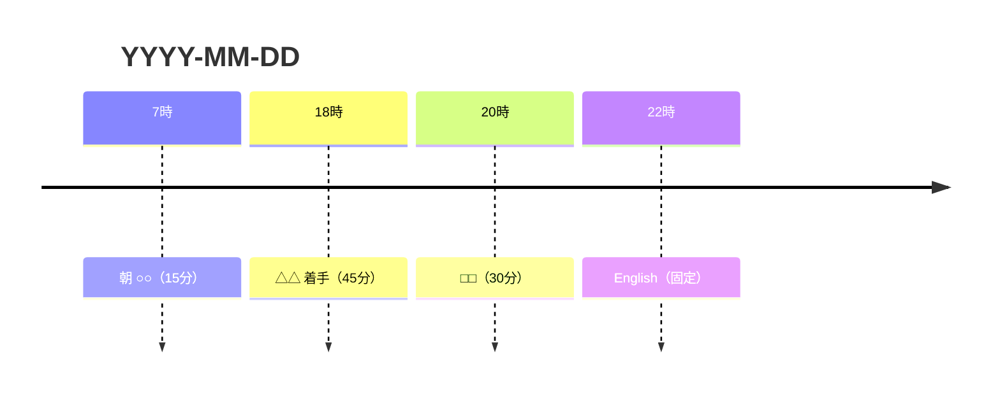

# 🗓 スケジュール（時間割を組む）

「やる気を出す」スキルではない。**「どれを・いつやるか」の決定をAIが肩代わりして、空いた時間にタスクを具体的な時間ブロックで置く** スキル。ユーザーは決めない・並べ替えるだけ。決定麻痺と「何から手を付けるか分からない」を消す。

> 関連：迷った瞬間に1つだけ欲しいなら `/next`。これは1日（or 1週間）全体を組む側。意味の再接続（なぜやるか）は `/next なぜ` を併用。

## 起動方法

- `/schedule` — 今日を対象に時間割を組む
- `/schedule 明日` — 明日を対象
- `/schedule 今週` — 今週の残り日にタスクを配分（粗め・日単位＋主要ブロック）
- `/schedule <Area>` — 指定 Area のタスクに絞って組む

## 🧭 必読コンテキスト

開始前に読む：

- `00_Intranet/AI運用ルール集（イントラ）/デザイン言語.md` — トーン（押し付けない・煽らない）
- `00_Intranet/AI運用ルール集（イントラ）/哲学・価値観.md` — 判断軸
- `00_Intranet/AI運用ルール集（イントラ）/🗂 vault構造ガイド.md` — タスク/予定の構造（既に把握済み前提なら省略可）

---

## 📋 フロー

### 1. 固定ブロックを読む（動かせない予定）

GCal スナップショット（PS1 が事前生成・vault外・**読み取り専用**）から、その日の確定予定を取る：

| 対象 | パス |
|---|---|
| 今日・明日 | `<workspace>\gcal_today.md` |
| 今週 | `<workspace>\gcal_week.md` |
| 今後14日 | `<workspace>\gcal_lookahead.md` |

- 時刻つきイベント＝固定ブロック。終日イベント＝その日の制約（例「名阪戦」「有休」）として扱う
- ファイルが無い場合は「GCalデータなし」と明記し、固定ブロックはユーザーに口頭確認する
- ⚠️ より正確な空き時間が要る時のみ google-calendar MCP（`list-events` / `get-freebusy`）を使う。**書き込みは §6 まで一切しない**

### 2. 使える時間帯を確定する

固定ブロックの隙間＝空き時間。ただし「物理的な空き」と「ユーザーが実際に作業に使える時間」は違う。

- 平日は日中が勤務 → タスク作業の主戦場は **朝・夜（特に 18:00〜24:00 のゴールデンタイム）** と見積もる
- 不明・曖昧なら **最初に1問だけ**聞く：「今日タスクに使えるのは何時から何時？（デフォルト: 夜18時以降＋朝の隙間）」
- 終日「有休」「名阪戦」等があれば日中も使える/使えないを反映

### 3. タスクを集めて選ぶ

```
Glob: 04_Tasks/タスク管理/タスク/*.md
```

`status: todo` / `in-progress` のみ対象（done / on-hold / cancelled / archived 除外）。**`start` が対象日より未来のタスクも除外**（意図的な先延ばし中・フォーカス・ファネル原則。start 当日以降になれば通常どおり配置対象）。各 frontmatter から `due` / `priority` / `area` / `next_action` / `completion_criteria` を取る。`/schedule <Area>` 指定時はその Area に絞る。

**所要時間はタスクに書かれていないことがほとんど** → AIが内容から見積もる（粗くてよい。例: 「ドキュメント30分読む」=30分、「予約候補を出す」=15分）。見積もりは控えめに、必ず**バッファを持たせる**。

**🧠 週1の深掘り枠（2026-08-06導入）**：`04_Tasks/タスク管理/タスク/*を深掘りする.md` のうち `status: todo` のものが1件以上あれば、**週に1枠だけ 45分ブロックを確保**する（`/schedule 今週` の時だけ。日次では取らない）。対象はその中で **`due` が最も近い1件**。ブロック名は「深掘り: <概念名>」とし、`next_action`（概念ノートの『登場した場面』を読み返して洞察を1つ書き足す）をそのまま添える。

- **頭が動く時間帯に置く**（朝イチ or 夜の早め）。締切物を押しのけない
- **1週間に1枠だけ**。溜まっている件数に比例して増やさない（増やすと結局どれも手が付かない）
- **背景（この枠が要る理由）**: 概念ノード新規作成時の自動起票は機能していて、2026-07-25〜08-06 の2週間で9件溜まったが **完了は0件**だった。2026-07-30 にユーザーが「原因は自動起票の仕組みではなく、深掘りに手を付ける時間がルーティン化されていないこと」と自己分析し、**根治は時間確保側で行う**と決めた。その実行がこの枠。自動起票の一時停止は撤回済み（→ 🗂 vault構造ガイド.md §第1.5層）

**🃏 今月のフォーカス概念（あれば・2026-07-21導入）**：`/next` と同じ経路で `concept_game/data/decks.json` の active デッキ `cards` と `board_quests.json` の `concepts` の積集合を取り、フォーカス概念に紐づくタスク stem 集合を作る（ファイル/デッキ/積集合が無ければこの節はスキップ）。該当タスクがあれば重み5として1枠を優先確保する（他の枠を圧迫しない範囲で）。

選定の重み（上から）：
0.5. **深掘り枠**（`/schedule 今週` の時のみ・週1枠45分）— 頭が動く時間帯に優先確保
1. 締切が今日〜数日で、放置すると被害が出るもの
2. その日の固定ブロックの準備に当たるもの（例: 明日歯科 → 今日中の準備）
3. 着手さえすれば軽いもの（freeze 解除）
4. 優先度 `高`
5. **フォーカス概念に紐づくタスク**（上記の積集合）— 1枠は頭が動く時間帯（朝イチ or 夜の早め）に優先配置。他の重みを押しのけてまで詰め込まない

### 4. 空き時間に割り付ける（時間割案）

空きウィンドウにタスクを置く。**置き方のルール**：

- **重い集中タスクは頭が動く時間帯**（朝イチ or 夜の早め）に。疲れている時間帯（夜遅く）には軽いもの
- **固定ブロックの直前は埋めない**（準備・移動の余白）
- **詰め込まない**。空きの 6〜7 割まで。余白を必ず残す（過密 → プレッシャー → 回避、で逆効果）
- 各ブロックに **最初の一歩**（`next_action` があればそれ）を添えて、着手で迷わないようにする
- 締切オーバーのタスクを入れる時も**煽らない**。「ここから仕切り直す枠」として淡々と置く

### 5. 案を提示（調整前提）

mermaid timeline ＋ 箇条書きの2本立てで出す（Obsidian/チャット両対応）。**時刻ラベルにコロン `:` を使わない**（mermaid timeline が壊れる。`22時` 形式で書く）。

````markdown
## 🗓 今日の時間割案 — YYYY-MM-DD (曜)



| 時間 | やること | 最初の一歩 | 目安 |
|---|---|---|---|
| 18:00-18:45 | <タスク> | <next_action> | 45分 |
| 20:00-20:30 | <タスク> | … | 30分 |
| 22:00- | English（固定予定） | — | — |

**余白**: <意図的に空けた時間帯と理由>
**入れなかった主なタスク**: <次点。理由1行>
````

提示後、ユーザーの調整を受ける（「これ動かして」「夜は空けたい」「これ抜いて」）。**説得しない・粘らない**。ユーザーが並べ替えたら案を更新する。

### 6. 出力先（ユーザーが選ぶ・デフォルトは何も書かない）

案を出した時点ではどこにも書き込まない（チャット提示のみ）。ユーザーが確定させたら、希望に応じて：

| 出力先 | 動作 | 注意 |
|---|---|---|
| チャットのみ | 何も書かない（デフォルト） | — |
| Home に貼る | `02_Home/Home.md` の該当セクションに時間割を書く | 朝スタンドアップ §3 と役割が違うので別セクション。上書きしない |
| **GCal に入れる** | google-calendar `create-event` で各ブロックを登録。`description` の先頭行に `shuki_task: <タスクファイルの相対パス>` を入れる（実行率トラッキング用の識別マーカー。`summary` は人間可読のまま変更しない。1ブロックに複数タスクをまとめる場合は複数行） | 🔴 **外部送信ゾーン。ユーザーが「カレンダーに入れて」と明示承認した時のみ**。ブロック単位で「これ入れる？」を確認。無人実行では改札フックが物理ブロックする |

- vault への**毎日の時間割ログは自動で作らない**（クラッタ防止）。ユーザーが「残して」と言った時だけ
- **タスクDBの frontmatter（status/priority/due）は触らない**

---

## 原則

- **決定を肩代わりする**。候補を並べて選ばせるのではなく、AIが「この順・この時間」を決めて出す。ユーザーは微調整だけ
- **詰め込まない・余白を残す**。完璧な分刻みは作らない。崩れる前提で緩く組む
- **着手点を明確に**。各ブロックに最初の一歩を添える（`/next` と同じ思想）
- **煽らない**。締切・遅れを赤字で強調しない。淡々と置く
- **書かせない・確認は最小**。ユーザーへの質問は使える時間帯くらい。あとはAIが組む
- お金・健康・パートナー絡みのタスクは**準備行動として時間に置くのは可**だが、実行（支払い・送信・受診予約の確定）はユーザー（人間確認ゾーン）
- GCal 書き込みは**ユーザーの明示承認時のみ**（§6）

## 🤝 他スキルとの関係

| 状況 | 行き先 |
|---|---|
| 今この1つだけ欲しい | `/next` |
| タスクが多すぎ・棚卸ししたい | `/audit-tasks` |
| そもそも目標から計画を立てたい | `/plan` |
| タスクの「なぜ」が薄くて乗らない | `/next なぜ` |

## 🔄 セルフQAの3行（出力末尾に必ず）

```
- 事実チェック: <固定ブロック・締切は実在の GCal/タスクに基づくか。所要見積もりは現実的か>
- トーン: <過密に詰めていないか・煽っていないか・押し付けていないか>
- アンチスロップ: <「これで完璧」「頑張ろう」系フィラーが混入していないか>
```
