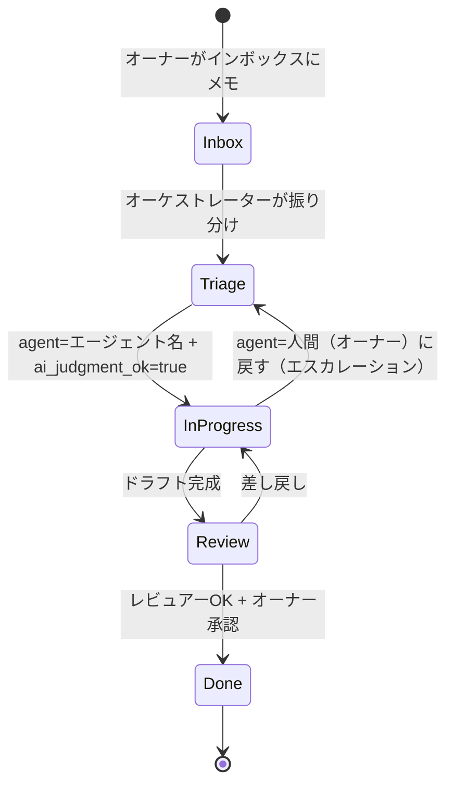

# ✅ タスク管理ルール

> [!note] ✅
>
> 参照DB：[[タスク管理]]

## 3.0 担当者プロパティの定義

`agent` フィールドは**人間とエージェントを同列に扱う**唯一の振り分けキー。

| 値 | 意味 |
|---|---|
| `人間（オーナー）` | オーナーが直接判断・実行する。AIは手を出さない |
| エージェント名（例: `infrastructure`） | そのエージェントが次のスキャン時に自動ピックアップ |
| 空欄 | 未アサイン。オーケストレーターが振り分ける |

エスカレーションは「ステータスを変える」ではなく「**`agent` を `人間（オーナー）` に戻す**」で表現する。

## 3.1 AIが自律ピックできる条件

以下を**全て満たす**タスクは、対応するエージェントが次の定期スキャン時に自律的に着手してよい。

- [ ]  **`agent`** に自分のエージェント名が指定されている
- [ ]  **`completion_criteria`** が1文で書かれている
- [ ]  **`ai_judgment_ok`** が `true` になっている
- [ ]  期限・Areaが設定されている

## 3.2 人間確認必須のタスク

以下は必ずドラフトのみを作り、オーナーのレビューを待つ。

- 💰 お金の判断（5,000円以上の支出、サブスク）
- 💼 仕事の外部発信（メール送信、上長への報告）
- 🩺 健康に関わる判断（運動メニュー、食事制限）

## 3.3 AIが起案しない領域（代筆禁止ゾーン）

> [!note] 🚫
>
> **以下は AI が代わりに書かない。オーナーが自分で一から書く。**
>
> AIに代筆させると、パートナーはAIと付き合っているようなもの。それはリスペクトの欠如であり、パートナーへの侮辱になる。
>
> - パートナーへのメッセージ・LINE・手紙の本文・下書き
> - パートナーへの贈り物に添える文章
> - パートナーへの予定提案の「伝え方」・言い回し
> - 「こう言ったらどう？」というトーン提案・代替案
> - パートナー宛の文章の校正・添削（事実関係のチェックを除く）

## 3.4 タスクのライフサイクル



## 3.5 引継ぎノートの標準フォーマット

エージェントがタスクを完了・エスカレーションする際、タスクファイルのコメント欄に以下を記録する。

```
## 引継ぎノート（YYYY-MM-DD / エージェント名）

### ここまでやったこと
（実行した内容を簡潔に）

### 選択肢と根拠
- 案A：〇〇 → メリット／デメリット
- 案B：〇〇 → メリット／デメリット

### 推奨案
（推奨とその理由を1文で）

### 次の一手
（オーナーがすぐ判断・実行できる形で）
```

## 3.6 エスカレーション手順（正しい止まり方）

判断の境界線を超えた、または完了条件を満たせないと判断した瞬間に止まり、以下を**この順番で**実行する。これは「失敗」ではなく**正しい完了形**。

1. 引継ぎノート（§3.5）をタスクファイルに記録する
2. タスクの `agent` を `人間（オーナー）` に変更する
3. `ai_judgment_ok` を `false` に変更する
4. 実行を停止し、オーナーの判断を待つ

> 「完了できなかった」ではなく「判断材料を揃えてオーナーに渡した」が正しいゴール。

## 3.7 タスク着手・完了時の記録ルール

エージェントがタスクを**着手・完了する際**、以下の手順でタスクファイルを更新する。エスカレーション（§3.6）とは別の「正常完了フロー」のルール。

### 着手時（担当エージェントとして作業を開始する時点）

1. frontmatter の `status` を更新：`todo` → `in-progress`
2. frontmatter の `agent` に自分のエージェント名を記入（空欄なら記入、既に名前があれば確認のみ）
3. `## 履歴` セクション（なければ作成）に1行追記：

```
- YYYY-MM-DD [エージェント名] 着手 — <一言で着手背景または受け取ったプロンプト>
```

### 完了時（成果物または作業が完成した時点）

1. frontmatter の `status` を更新：`in-progress` → `done`
2. `## 履歴` に1行追記：

```
- YYYY-MM-DD [エージェント名] 完了 — <一言で完了内容>
```

### 補足

- `reviewer` にレビューを依頼するタイミングでも1行追加する：`- YYYY-MM-DD [エージェント名] レビュー依頼 — reviewer へ`
- **エスカレーション時は §3.6 の手順に従う**（引継ぎノートを書き、`agent` を `人間（オーナー）` に変更）
- frontmatter キー `agent` は担当エージェント名を表す。一覧: `orchestrator` / `reviewer` / `relationship` / `english` / `self-analysis` / `finance` / `planner` / `knowledge` / `infrastructure` / `人間（オーナー）`

## 3.8 インボックス情報移行ルール

インボックスファイルの処理に関する**全エージェント共通ルール**。

### 基本方針

- **`status: done` のインボックスファイルは削除不要**（処理履歴として残す価値がある）
- **ただし、ファイルが持つ情報は必ず正式な場所に移行してから done にする**

### 移行先の判断基準

| 情報の種類 | 移行先 |
|---|---|
| 参照・手順・予約情報 | `06_Resources/Resources/ナレッジ/` |
| 日付付きの出来事・対話・記録 | `07_Logs/ログ/` |
| 行動・予約・完了が必要なもの | `04_Tasks/タスク管理/タスク/` |
| プロジェクト全体に関わる情報 | `03_Projects/プロジェクト/<name>.md` |

### 処理順序（インボックス整理時の必須チェック）

1. インボックスの内容を読む
2. 「この情報は正式な場所にあるか？」を確認する
3. なければ移行する
4. 移行先を `destination:` フィールドに記入する
5. `status: done` に更新する

> ⚠️ 「削除するか」を先に考えない。「内容が正式ファイルに転記されているか」を先に確認する。これが正しい順序。