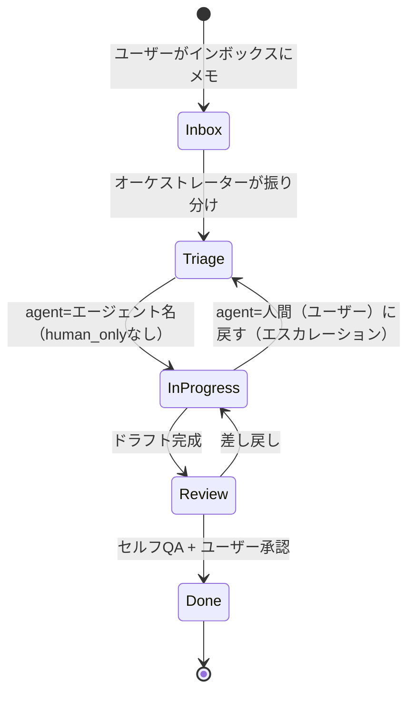

# ✅ タスク管理ルール

> [!note] ✅
>
> 参照DB：[[タスク管理]]

## 3.0 担当者プロパティの定義

`agent` フィールドは**人間とエージェントを同列に扱う**唯一の振り分けキー。

| 値 | 意味 |
|---|---|
| `人間（ユーザー）` | ユーザーが直接判断・実行する。AIは手を出さない |
| エージェント名（例: `infrastructure`） | そのエージェントが次のスキャン時に自動ピックアップ |
| 空欄 | 未アサイン。オーケストレーターが振り分ける |

エスカレーションは「ステータスを変える」ではなく「**`agent` を `人間（ユーザー）` に戻す**」で表現する。

## 3.1 AIが自律ピックできる条件

以下を**全て満たす**タスクは、対応するエージェントが次の定期スキャン時に自律的に着手してよい。

- [ ]  **`agent`** に自分のエージェント名が指定されている
- [ ]  **`completion_criteria`** が1文で書かれている
- [ ]  **`human_only`** が立っていない（未記入がデフォルト＝AI可。判定の正は `vault-scripts/ai_lane.py`）
- [ ]  期限・Areaが設定されている

> ⚠️ **AIレーンと「最終アクションを人間確認なしで実行してよいか」は別軸**（2026-08-07 明確化 / 2026-09-04 フラグ廃止に伴い改訂）。lane が `ai` / `prep` なのは「下ごしらえ〜完了まで自律で進めてよい」を意味するだけで、§3.2（お金・健康・外部送信ゾーン）に触れる最終アクションは、この値に関わらず必ず決裁（`99_System/decisions/`）を経由する。逆に言えば、`agent` は下ごしらえ担当を表すフィールドなので、お金・健康ゾーンのタスクでも空欄にせずTier Aエージェントへ調査・比較・ドラフトを割り振ってよい——最終判断だけを決裁に上げれば、下ごしらえの自律実行と人間確認は両立できる。

## 3.2 人間確認必須のタスク

以下は必ずドラフトのみを作り、**最終判断は決裁（`99_System/decisions/`）へ上げて**ユーザーのレビューを待つ。`agent` は下ごしらえ担当（Tier Aエージェント名）を設定してよく、空欄のままにしない。

- 💰 お金の判断（5,000円以上の支出、サブスク）
- 💼 仕事の外部発信（メール送信、上長への報告）
- 🩺 健康に関わる判断（運動メニュー、食事制限）

## 3.3 AIが起案しない領域（代筆禁止ゾーン）

> [!note] 🚫
>
> **以下は AI が代わりに書かない。ユーザーが自分で一から書く。**
>
> AIに代筆させると、相手はAIと付き合っているようなもの。それはリスペクトの欠如であり、相手への侮辱になる。
>
> - パートナーへのメッセージ・LINE・手紙の本文・下書き
> - パートナーへの贈り物に添える文章
> - パートナーへの予定提案の「伝え方」・言い回し
> - 「こう言ったらどう？」というトーン提案・代替案
> - 代筆禁止ゾーン宛の文章の校正・添削（事実関係のチェックを除く）

## 3.4 タスクのライフサイクル


```mermaid
stateDiagram-v2
	[*] --> Inbox: ユーザーがインボックスにメモ
	Inbox --> Triage: オーケストレーターが振り分け
	Triage --> InProgress: agent=エージェント名（human_onlyなし）
	InProgress --> Review: ドラフト完成
	Review --> Done: セルフQA + ユーザー承認
	Review --> InProgress: 差し戻し
	InProgress --> Triage: agent=人間（ユーザー）に戻す（エスカレーション）
	Done --> [*]
```

## 3.5 引継ぎノートの標準フォーマット

エージェントがタスクを完了・エスカレーションする際、タスクファイルのコメント欄に以下を記録する。

```
## 引継ぎノート（YYYY-MM-DD / エージェント名）

### ここまでやったこと
（実行した内容を簡潔に）

### 選択肢と根拠
- 案A：〇〇 → メリット／デメリット
- 案B：〇〇 → メリット／デメリット

### 推奨案
（推奨とその理由を1文で）

### 次の一手
（ユーザーがすぐ判断・実行できる形で）
```

## 3.6 エスカレーション手順（正しい止まり方）

判断の境界線を超えた、または完了条件を満たせないと判断した瞬間に止まり、以下を**この順番で**実行する。これは「失敗」ではなく**正しい完了形**。

1. 引継ぎノート（§3.5）をタスクファイルに記録する
2. タスクの `agent` を `人間（ユーザー）` に変更する
3. `human_only: true` を立てる（AIレーンの🧠へ固定される）
4. `status` を `on-hold` に変更する（ディスパッチ対象から外れ、`99_System/decisions/open.json` の決裁の山に載る）
5. 実行を停止し、ユーザーの判断を待つ

> 「完了できなかった」ではなく「判断材料を揃えてユーザーに渡した」が正しいゴール。
> ⚠️ `status: on-hold` だけ立てて `agent` / `human_only` を変えない差し戻しは不完全（2026-07-12 統一）。必ず上の5手順セットで行う。

## 3.7 タスク着手・完了時の記録ルール

エージェントがタスクを**着手・完了する際**、以下の手順でタスクファイルを更新する。エスカレーション（§3.6）とは別の「正常完了フロー」のルール。

### 着手時（担当エージェントとして作業を開始する時点）

1. frontmatter の `status` を更新：`todo` → `in-progress`
2. frontmatter の `agent` に自分のエージェント名を記入（空欄なら記入、既に名前があれば確認のみ）
3. `## 履歴` セクション（なければ作成）に1行追記：

```
- YYYY-MM-DD [エージェント名] 着手 — <一言で着手背景または受け取ったプロンプト>
```

### 完了時（成果物または作業が完成した時点）

1. frontmatter の `status` を更新：`in-progress` → `done`
2. `## 履歴` に1行追記：

```
- YYYY-MM-DD [エージェント名] 完了 — <一言で完了内容>
```

### 補足

- **エスカレーション時は §3.6 の手順に従う**（引継ぎノートを書き、`agent` を `人間（ユーザー）` に変更）
- frontmatter キー `agent` は担当エージェント名を表す。一覧: `orchestrator` / `relationship` / `english` / `researcher` / `finance` / `knowledge` / `infrastructure` / `人間（ユーザー）`
- **`担当: ユーザー`（人間担当・`AI判断OK: false`）のタスクも対象**。会話内でユーザーが完了を明言したら、AI（Claude Code本体・エージェント問わず）はその場で `status` を `done` に書き換え、`## 履歴` に1行追記する。「履歴には書いたが `status` は触らない」という中途半端な反映をしない（2026-08-13追加。ntfy購読先切替タスクで、完了記録はあるのに `status: todo` のまま放置されていた実例を機に明文化）
- 1タスクに複数の作業項目が混在する場合、**全項目が完了して初めて** `done` にする。一部完了の時点では `status` を変えず `## 履歴` に進捗のみ追記する

## 3.8 インボックス情報移行ルール

インボックスファイルの処理に関する**全エージェント共通ルール**。

### 基本方針

- **`status: done` のインボックスファイルは削除不要**（処理履歴として残す価値がある）
- **ただし、ファイルが持つ情報は必ず正式な場所に移行してから done にする**

### 移行先の判断基準

| 情報の種類 | 移行先 |
|---|---|
| 参照・手順・予約情報 | `06_Resources/Resources/ナレッジ/` |
| 日付付きの出来事・対話・記録 | `07_Logs/ログ/` |
| 行動・予約・完了が必要なもの | `04_Tasks/タスク管理/タスク/` |
| プロジェクト全体に関わる情報 | `03_Projects/プロジェクト/<name>.md` |

### 処理順序（インボックス整理時の必須チェック）

1. インボックスの内容を読む
2. 「この情報は正式な場所にあるか？」を確認する
3. なければ移行する
4. 移行先を `destination:` フィールドに記入する
5. `status: done` に更新する

> ⚠️ 「削除するか」を先に考えない。「内容が正式ファイルに転記されているか」を先に確認する。これが正しい順序。

## 3.9 エージェント間ハンドオフ（2026-07-12 新設）

タスク実行中に**自分の領分外の後続工程**が見つかったとき（例: finance が集計中に「この記事をナレッジ化すべき」と気づく → knowledge の領分）、チャット内で済ませず**ハンドオフタスクを起票**する。これが「AI同士のタスク受け渡し」の唯一の正式ルート。

### 起票の手順

1. `04_Tasks/タスク管理/タスク/<タイトル>.md` を新規作成（1タスク1ファイル）：

```yaml
---
title: "<後続工程のタイトル>"
agent: <Tier A エージェント名>   # finance / knowledge / english / researcher のみ
status: todo
completion_criteria: "<1文>"     # 必須。書けないなら human_only: true を付けて起票
parent: "[[<元タスク名>]]"
area: <元タスクの area を継承>
date: YYYY-MM-DD
created: YYYY-MM-DD
---
```

2. 本文に**起票理由**（なぜ自分の領分外か・1行）と**引継ぎノート（§3.5様式）**、参照リンク（相対パス）を書く
3. 元タスクの `## 履歴` に1行追記：`- YYYY-MM-DD [自エージェント名] ハンドオフ起票 — <新タスク名>（担当: <エージェント名>）`

### 拾われ方（リレー）

- **同便リレー**: 12:30 ディスパッチ便の実行中に起票されたものは、同便の再スキャン（1回のみ）で即実行される（orchestrator.md §🚚）
- **それ以外**: 翌日 12:30 便が自動ピックアップ

### 制約

- **Tier B（orchestrator / relationship / infrastructure）と自分自身へのハンドオフは禁止**。人間の判断が要るなら §3.6 のエスカレーション（`agent: 人間（ユーザー）`）へ
- 1タスクの実行から起票するハンドオフは**最大2件**（タスクの無限増殖防止）
- AIに任せてよいかの判定は `vault-scripts/ai_lane.py` が自動で行う（起票者はフラグを書かない）。代筆禁止ゾーン・内省・学習・対面・お金・外部送信は自動ガードが機械的に止めるので、起票時に気にしなくてよい
- 代筆禁止・お金・健康・外部送信ゾーンは従来どおり継承（ハンドオフしても解除されない）

## 3.10 タスク粒度とレビュー単位（2026-09-18 導入）

タスクは「最小の作業」ではなく、**進捗と品質を別々に確認できる最小の成果単位（レビュー単位）**で切る。

### タスクの境界

- 1タスク = 1つの意味のある成果（成果物・決定・検証結果のいずれか）。
- `completion_criteria` は、その成果が何を満たせば完了かを1文で書く。
- ファイルを開く／読む／編集するなどの単純な行動は、タスク本文の手順に置き、独立タスクにしない。
- 完了条件・担当・ブロッカー・レビュー点のいずれかが異なるなら、子タスクに分けて `parent` / `children` で接続する。
- 「この結果だけを別にレビューしたいか？」に Yes なら別タスク候補、No なら同じタスクの手順に残す。
- 実行セッションでは複数タスクをまとめて進めてよいが、進捗とレビューの単位は分けたままにする。

### 結果・レビューの記録

タスクを `done` にする前、およびエスカレーション・引継ぎ時は、本文に以下を記録する。新規タスクでは空欄の見出しを先に置いてよい。

```markdown
## 結果・レビュー
- 証拠:
- レビュー: pending
- 未解決:
- 次の一手:
```

- **証拠**: 成果物・リンク・テスト結果・決定内容など、完了を示すもの。
- **レビュー**: `self-checked`（実行者のセルフチェック）／`accepted`（ユーザー・依頼者の受入）／`pending`（人間確認待ち）／`needs-revision`（要修正）／`blocked`（判断・外部要因待ち）のいずれかを本文に記録する。`status` の値は増やさない。
- **未解決**: 残課題がなければ「なし」と書く。残っている場合は、後続タスクまたは判断待ちの内容を具体化する。
- **次の一手**: 未完了なら次に行う行動を書く。`done` なら後続タスク／Projectへの引継ぎがある場合だけ書く。
- `status: done` は、`completion_criteria` を満たし、証拠があり、実行者のセルフチェック（`self-checked`）まで完了した状態を指す。人間の受入が必要な成果は `レビュー: pending` のまま完了にしてよいが、親Project／マイルストーンの受入とは分けて扱う。

### 進捗と品質の分離

- **進捗**は `status` と `parent` / `children` から見る。親の進捗は子タスクの完了数を目安にし、チェックリストの項目数は分子・分母にしない。
- 子タスクの大きさが大きく違う場合、件数の割合を達成率として断定せず、`todo` / `in-progress` / `on-hold` とブロッカーを併記する。
- **品質**は `結果・レビュー` の `証拠` と `レビュー` で見る。マイルストーンの受入は、必要な子タスクのレビューが `accepted` になるまで確定しない。
- レビューに独立した担当・時期・判断があり、次のマイルストーンを止める場合だけ、レビューを別の子タスクにする。それ以外は元タスクの `結果・レビュー` に含める。
