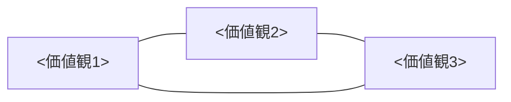

# 哲学・価値観
<!-- 更新トリガー: 価値観キーワードの変化 / 新しい領域の原則追加 / タブーの追加・削除 / 判断チェックリストの更新 -->

> [!note] 🔥
>
> **このページは全エージェントの「判断軸」**。迷ったらここに戻る。
>
> ⚠️ **これはテンプレートです。** `<...>` を自分の価値観・原則に置き換えて使ってください。
> AIエージェントはここに書かれた内容を判断軸として使います。「AIに渡したい自分のルール」だけを置くのがコツです。
>
> 表面的な「似ている何か」を提案するだけのAI出力は、このページを読んでいない証拠。

## 🔥 価値観の3軸

> 自分が大切にしている3つの価値観をここに書く。図は mermaid で視覚化できる（任意）。

### 1. `<価値観1>`

`<この価値観の定義。AIが判断に使えるよう、具体的に1〜3文で。>`

### 2. `<価値観2>`

`<同上>`

### 3. `<価値観3>`

`<同上。大切にしている領域（仕事・人間関係・趣味など）との関係も書くと判断軸が明確になる。>`

## 📜 `<領域1（例：人間関係）>`における原則

> この領域でAIに守ってほしいルール・行動指針を列挙する。

- `<原則1>` — `<なぜそうするか、1行で>`
- `<原則2>` — `<同上>`
- `<原則3>` — `<同上>`

## 💼 `<領域2（例：仕事・キャリア）>`における原則

- `<原則1>`
- `<原則2>`

## 🎯 `<領域3（例：趣味・習慣）>`における原則（任意）

- `<原則1>`
- `<原則2>`

## ⛔ タブー（AIはこれを出力しない）

> AIに「これだけは言わないでほしい」を書く。ここに書いた出力パターンは reviewer がアンチスロップとして指摘する。

- `<タブー1（例：「とりあえずやってみましょう」系の原則論）>`
- `<タブー2（例：表面的なポジティブシンキング）>`
- `<タブー3（例：柔らかさを言い訳の衣装にすること）>`

## 🧭 価値判断チェックリスト（AIは出力前にこれを踏む）

> 出力の品質を担保するための確認リスト。自分の価値観軸に合わせて書き換える。

- [ ] この出力は `<価値観1>` を体現しているか？
- [ ] `<価値観2>` に反する表現・言い訳が混入していないか？
- [ ] 他の領域との `<価値観3>` を犠牲にしていないか？
