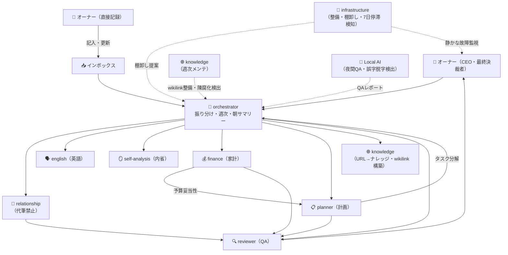

# 🏢 AI組織図 ＆ RACI

> [!note] 📌
>
> **現在の実体（2026-06-01 更新）**：**9体** が `.claude/agents/` に定義済み + Local AI（Ollama）1系統。
>
> ⚠️ **このページは組織の俯瞰図・RACI。各エージェントの正式仕様は `.claude/agents/<name>.md` が唯一の正**。この図・RACI表と食い違う場合は `.claude/agents/` を信じること。
>
> 統括：🎯 orchestrator　QA：🔍 reviewer　関係性：💞 relationship　内省：🪞 self-analysis　家計：💰 finance　計画：📋 planner　英語：🗣 english　ナレッジ：🌐 knowledge　インフラ：🧹 infrastructure　＋ 🧠 Local AI（夜間QA）

## 組織図

## 責任範囲マトリクス（RACI簡易版）

| 役割 | AIが自律で判断OK | 人間（オーナー）の確認必須 |
| --- | --- | --- |
| 🎯 オーケストレーター | タスクの振り分け、優先度の初期付与 | 新規プロジェクトの起票、Areas変更 |
| 💞 関係性エージェント（裏方専任） | 記憶の整理、事実関係チェック、内省の壁打ち（問いを投げるだけ） | パートナーへの文章は一切作らない（§3.3）。代わりに言葉化しない |
| 🪞 自己理解 | 内省ログ横断、パターン抽出、問いの提示 | 評価・判断はしない |
| 🗣 英語 | IELTS添削、語彙ノート、文法解説 | スピーキング訓練対象外 |
| 💰 家計・お金 | 支出ログ転記、月次レポート、固定費棚卸し提案、貯蓄進捗 | 実際の支払い・解約・送金・投資注文 |
| 📋 計画・企画 | 旅行プラン、比較表、必要書類チェック、決断補助 | 実際の予約・購入、家族の予定確定、¥10万円以上の購入はReviewer必須 |
| 🌐 ナレッジ | URL→ナレッジノート変換、wikilink構築、週次メンテ（孤立ノート補完・陳腐化検出） | 既存ノート本文の書き換え、MOC新規作成、外部送信 |
| 🔍 レビュアー | 事実確認、整合性チェック、文体校正 | 「却下」の最終判断はオーナー |
| 🧹 インフラ（**基盤系**） | 7日以上停滞タスクの抽出、矛盾検出、タグ統一の提案、重複候補抽出 | ページ削除、DB構造変更、自動マージ |
| 🧠 Local AI（**夜間QA担当・Ollama**） | 23-06時のvault誤字脱字・frontmatter QA、検出レポート追記 | vault本体への一切の書き換え／代筆／外部送信 |

## AI社員の3要素

各エージェントは以下3つの組み合わせで成立。どれかが欠けると機能しない。

- 📜 **マニュアル（指示書）** — 何をする／しないか、どう判断するか。各エージェントの instructions に書く。このイントラを必ず参照させる
- 🧠 **脳（モデル）** — タスクの難易度に応じて使い分ける（→ 💰 モデル戦略）
- 🪑 **机（文脈環境）** — 独立したスレッドで動かす。1スレッドに複数タスクを混ぜない

## Areas → 部門対応表

vault は 10 Area で運用（マイルーティンは Phase 2 で廃止、娯楽を新規追加）：

| カテゴリ | Area | 対応エージェント |
| --- | --- | --- |
| 💞 関係・核 | パートナーとの関係 | relationship（代筆禁止） |
| 💞 関係・核 | 人間関係 | 記録サポートのみ・代筆禁止 |
| 💞 関係・核 | 自己理解 | self-analysis |
| 💼 キャリア・学び | 仕事 | 担当エージェントなし（オーナー直） |
| 💼 キャリア・学び | 英語 | english |
| 💪 体・習慣 | ハンドボール | 担当エージェントなし（オーナー直） |
| 💪 体・習慣 | 健康 | オーナー直、インフラがログ棚卸し |
| 🎮 余暇 | 娯楽 | knowledge（ナレッジ蓄積）・オーナー直 |
| 🧱 基盤・運用 | お金 | finance |
| 🧱 基盤・運用 | 時間管理 | infrastructure |

横断担当：
- **計画・企画**（旅行・大型購入） → planner
- **QA** → reviewer（Claude Code セッション中）／Local AI（夜間バッチ）
- **整備** → infrastructure

> [!note] 📌
>
> **専門 vs 基盤**：英語・自己理解・関係性は「Areaを担当する **専門** エージェント」。インフラと Local AI は「全Areaに横断して効く **基盤** エージェント」。RACIも責任範囲も別立てで考える。
