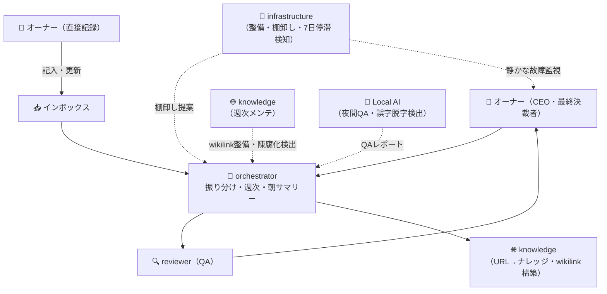

# 🏢 AI組織図 ＆ RACI

> [!note] 📌
>
> **現在の実体（コア4体）**：orchestrator / reviewer / infrastructure / knowledge が `.claude/agents/` に定義済み + Local AI（Ollama）1系統。
>
> 専門エージェント（finance・english・relationship 等）は個人の用途に合わせて追加する。
> `.claude/agents/<name>.md` を追加するだけで Claude Code が自動認識する。
>
> ⚠️ **このページは組織の俯瞰図・RACI。各エージェントの正式仕様は `.claude/agents/<name>.md` が唯一の正**。この図・RACI表と食い違う場合は `.claude/agents/` を信じること。

## 組織図（コア構成）

> **専門エージェントを追加する場合**: `O --> S["🆕 <agent-name>"]` を mermaid に追記し、RACI表に行を追加する。

## 責任範囲マトリクス（RACI簡易版）

| 役割 | AIが自律で判断OK | 人間（オーナー）の確認必須 |
| --- | --- | --- |
| 🎯 オーケストレーター | タスクの振り分け、優先度の初期付与 | 新規プロジェクトの起票、Areas変更 |
| 🌐 ナレッジ | URL→ナレッジノート変換、wikilink構築、週次メンテ（孤立ノート補完・陳腐化検出） | 既存ノート本文の書き換え、MOC新規作成、外部送信 |
| 🔍 レビュアー | 事実確認、整合性チェック、文体校正 | 「却下」の最終判断はオーナー |
| 🧹 インフラ（**基盤系**） | 7日以上停滞タスクの抽出、矛盾検出、タグ統一の提案、重複候補抽出 | ページ削除、DB構造変更、自動マージ |
| 🧠 Local AI（**夜間QA担当・Ollama**） | 00:01-18:00のvault誤字脱字・frontmatter QA、検出レポート追記（18:00-24:00はゴールデンタイム停止） | vault本体への一切の書き換え／代筆／外部送信 |

> **専門エージェント追加例**: finance（家計見える化）/ english（語学学習）/ planner（旅行・購入計画）/ relationship（関係性サポート）/ self-analysis（内省）等。各エージェントの責任範囲は `.claude/agents/<name>.md` に定義する。

## AI社員の3要素

各エージェントは以下3つの組み合わせで成立。どれかが欠けると機能しない。

- 📜 **マニュアル（指示書）** — 何をする／しないか、どう判断するか。各エージェントの instructions に書く。このイントラを必ず参照させる
- 🧠 **脳（モデル）** — タスクの難易度に応じて使い分ける（→ 💰 モデル戦略）
- 🪑 **机（文脈環境）** — 独立したスレッドで動かす。1スレッドに複数タスクを混ぜない

## Areas → 部門対応表（カスタマイズ例）

vault の Area 数・名称は自由に設定する。以下は10 Area 運用の例：

| カテゴリ | Area（例） | 対応エージェント（例） |
| --- | --- | --- |
| 💼 キャリア・学び | `<仕事>` | 担当エージェントなし（オーナー直）または専門エージェント |
| 💼 キャリア・学び | `<語学>` | 語学学習エージェント |
| 💪 体・習慣 | `<スポーツ>` | 担当エージェントなし（オーナー直） |
| 💪 体・習慣 | `<健康>` | オーナー直、インフラがログ棚卸し |
| 🎮 余暇 | `<娯楽>` | knowledge（ナレッジ蓄積）・オーナー直 |
| 🧱 基盤・運用 | `<お金>` | 家計エージェント |
| 🧱 基盤・運用 | `<時間管理>` | infrastructure |

横断担当：
- **QA** → reviewer（Claude Code セッション中）／Local AI（夜間バッチ）
- **整備** → infrastructure

> [!note] 📌
>
> **専門 vs 基盤**：専門エージェントは「特定 Area を担当する」。インフラと Local AI は「全 Area に横断して効く **基盤** エージェント」。RACIも責任範囲も別立てで考える。
