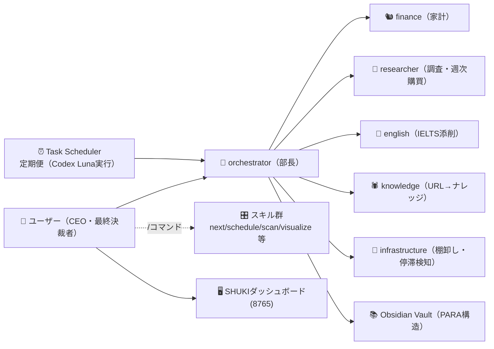

# 🏢 AI組織図 ＆ RACI

> [!note] 📌
>
> **現在の実体（2026-09-15 更新）**：**6体**（orchestrator + Tier1〜3の5体）が `.claude/agents/` に定義済み。relationship は2026-06-14廃止済み・Phase 4（2026-09-06〜）で非公開Area情報はAI対象外。
>
> ⚠️ **このページは組織の俯瞰図・RACI。各エージェントの正式仕様は `.claude/agents/<name>.md` が唯一の正**。この図・RACI表と食い違う場合は `.claude/agents/` を信じること。
>
> 統括：🐙 orchestrator　Tier1：🐿️ finance／🦊 researcher　Tier2：🦜 english／🕷️ knowledge　Tier3：🦔 infrastructure　／ QAはセルフQA（各エージェント）＋ vault_lint（決定的チェック・毎日00:05）＋ 🔴ゾーンのユーザー確認 に分散
>
> 🏢 **運用モデル（2026-07-04 明文化）**：ユーザー＝CEO（決裁のみ）、orchestrator＝部長（振り分け・L2判断）、Tier1〜3＝実行部隊。**毎日12:30の🚚タスクディスパッチ便**が AIレーン `ai`/`prep`（`vault-scripts/ai_lane.py`）のタスクを担当に流し、結果は翌朝ブリーフィングの決裁カードでユーザーに届く（AI同士でタスクが進む社内便・orchestrator.md §🚚 が正）。エージェントは**自動実行可**、スキル（`/next` 等）は**ユーザーが対話で手動起動**という別レイヤー（棲み分けは `AGENTS.md` §🛠 参照）。

## 組織原則（この組織が拠る4つ）

**「どのAIが強いか」ではなく「どう回すか」で勝負する。** 人間の組織原則をAI向けにアレンジした運用設計こそが差を生む。

1. **専門家による役割分担** — 1体に全てさせない。役割を細分化する（文脈混在・ハルシネーション・自己チェックの限界を避ける）
2. **書き物による引き継ぎ** — 会議ではなくドキュメント（このイントラとタスクDB）で共有・記録
3. **責任の所在の明示** — AI判断OK／人間確認必須の境界を明確にする（→ 下記 RACI）
4. **代筆させない領域の守り** — AIに任せると「ユーザーの言葉」でなくなるもの（パートナーへの言葉など）は適用領域を明確に除外する（§3.3）

## 組織図

ユーザーを起点に、①エージェント（自動実行・orchestratorが振り分け）②スキル（ユーザーが`/`で手動起動）③基盤（Vault・ダッシュボード・Task Scheduler）の3層で構成される（`AGENTS.md` §🛠 ツール別の差分）。Tier1（即時運用）〜3（インフラ点検）の階層は表下の RACI・[[🛠 Technical Setup]] を参照。

```mermaid
flowchart LR
	Sched["⏰ Task Scheduler<br>定期便（Codex Luna実行）"] --> O["🐙 orchestrator（部長）"]
	H["🧑 ユーザー（CEO・最終決裁者）"] --> O
	O --> Fin["🐿️ finance（家計）"]
	O --> Res["🦊 researcher（調査・週次購買）"]
	O --> Eng["🦜 english（IELTS添削）"]
	O --> Kno["🕷️ knowledge（URL→ナレッジ）"]
	O --> Infra["🦔 infrastructure（棚卸し・停滞検知）"]
	O --> Vault["📚 Obsidian Vault（PARA構造）"]
	H -.->|"/コマンド"| Sk["🎛️ スキル群<br>next/schedule/scan/visualize 等"]
	H --> Board["🖥️ SHUKIダッシュボード(8765)"]
```

実寸700px幅・倍率1.0で確認済み（2026-09-15、`reference/mermaid_proportions.md` の検証手順に準拠）。

## 責任範囲マトリクス（RACI簡易版）

| 役割 | AIが自律で判断OK | 人間（ユーザー）の確認必須 |
| --- | --- | --- |
| 🎯 オーケストレーター | タスクの振り分け、優先度の初期付与 | 新規プロジェクトの起票、Areas変更 |
| 💞 関係性エージェント（裏方専任） | 記憶の整理、事実関係チェック、内省の壁打ち（問いを投げるだけ） | パートナーへの文章は一切作らない（§3.3）。代わりに言葉化しない |
| 🔍 researcher（調査・計画） | 旅行プラン、比較表、必要書類チェック、WebFetch調査 | 実際の予約・購入、家族の予定確定、5,000円以上の購入はユーザー確認必須 |
| 🗣 英語 | IELTS添削、語彙ノート、文法解説 | スピーキング訓練対象外 |
| 💰 家計・お金 | 支出ログ転記、月次レポート、固定費棚卸し提案、貯蓄進捗 | 実際の支払い・解約・送金・投資注文 |
| 🌐 ナレッジ | URL→ナレッジノート変換、wikilink構築、週次メンテ（孤立ノート補完・陳腐化検出） | 既存ノート本文の書き換え、MOC新規作成、外部送信 |
| 🧹 インフラ（**基盤系**） | 7日以上停滞タスクの抽出、矛盾検出、タグ統一の提案、重複候補抽出 | ページ削除、DB構造変更、自動マージ |
| 🧠 Local AI（**取り込み担当・Ollama**） | OCR下書き生成（`_ocr_out/` のみ）、音声メモ文字起こし→インボックス投入 | vault本体（`_ocr_out/` 以外）への一切の書き換え／代筆／外部送信。※夜間QAループは 2026-07-02 廃止 → 後継は vault_lint.py（Python・決定的） |

## AI社員の3要素

各エージェントは以下3つの組み合わせで成立。どれかが欠けると機能しない。

- 📜 **マニュアル（指示書）** — 何をする／しないか、どう判断するか。各エージェントの instructions に書く。このイントラを必ず参照させる
- 🧠 **脳（モデル）** — タスクの難易度に応じて使い分ける（→ [[🛠 Technical Setup]] §モデル戦略）
- 🪑 **机（文脈環境）** — 独立したスレッドで動かす。1スレッドに複数タスクを混ぜない

## Areas → 部門対応表

vault は 11 Area で運用（マイルーティンは Phase 2 で廃止、娯楽を新規追加、AI運用を2026-09-09追加）：

> ⚠️ 下表の「relationship」表記は2026-06-14廃止済みエージェントの残存記述。非公開AreaはPhase 4（2026-09-06〜）でAI対象外・deny設定に移行済み（詳細は `AGENTS.md` §🚫 非公開Area情報は扱わない）。

| カテゴリ | Area | 対応エージェント |
| --- | --- | --- |
| 💞 関係・核 | 非公開Area | AI対象外（Phase 4・ユーザーが自分で考える） |
| 💞 関係・核 | 人間関係 | 記録サポートのみ・代筆禁止 |
| 💞 関係・核 | 自己理解 | ユーザー直（/check-in スキルで内省） |
| 💼 キャリア・学び | 仕事 | 担当エージェントなし（ユーザー直） |
| 💼 キャリア・学び | 英語 | english |
| 💪 体・習慣 | ハンドボール | 担当エージェントなし（ユーザー直） |
| 💪 体・習慣 | 健康 | ユーザー直、インフラがログ棚卸し |
| 🎮 余暇 | 娯楽 | knowledge（ナレッジ蓄積）・ユーザー直 |
| 🧱 基盤・運用 | お金 | finance |
| 🧱 基盤・運用 | 時間管理 | infrastructure |
| 🧱 基盤・運用 | AI運用 | infrastructure |

横断担当：
- **調査・計画**（旅行・大型購入・比較） → researcher
- **QA** → セルフQA（各エージェントが出力末尾に3行）／vault_lint（毎日00:05・決定的チェック）／🔴ゾーンはユーザーが確認
- **整備** → infrastructure

> [!note] 📌
>
> **専門 vs 基盤**：英語・自己理解・関係性は「Areaを担当する **専門** エージェント」。インフラと Local AI は「全Areaに横断して効く **基盤** エージェント」。RACIも責任範囲も別立てで考える。
