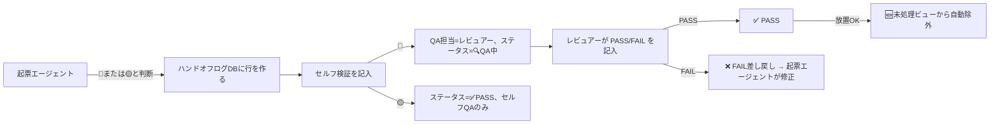

# 🔄 QAサイクル

> [!note] 🔄
>
> **「書きっぱなし」を禁止するための単一のサイクル。**
>
> すべての重要な出力は「起票 → セルフQA → ハンドオフ → 必要なQA → PASS/FAIL」の流れを通る。
>
> コストと品質のトレードオフを取るため、**全出力に全者を適用しない**（§10.1）。

## 10.1 適用範囲（3段階）

| ゾーン | 要件 | 例 |
| --- | --- | --- |
| 🔴 **QA必須** | ハンドオフログDBに記録 + レビュアーがPASS/FAILを返すまで未完了 | 仕事の外部メール、人生の方向性判断、5万円以上の支出、パートナー宛文章の事実チェック |
| 🟡 **セルフQA** | 起票エージェントが「セルフ検証」を出力末尾に添える（ハンドオフログ記録は任意） | 通常のドラフト、調査要約、タスク整理、週次ブリーフ |
| ⚪ **QA不要** | そのまま。ログも不要 | インボックス振り分け、タグ付け、誤字チェック、定型スタンドアップ |

> [!note] ⚠️
>
> 迷ったら**一段上「厳しい」側に寄せる**。「必須かもしれない」と思ったら🔴、「セルフでいいかも」と思ったら🟡。

## 10.2 ハンドオフ・ログDB の使い方

保存先：[[タスク管理|📋 タスク管理DB]]（ハンドオフログはタスクDBに統合済み）

> [!note] 🔗
>
> **タスクDBとの2-wayリレーション**：ハンドオフログ側に「🎯 関連タスク」、タスクDB側に「📋 関連ハンドオフ」プロパティを追加済み。1ハンドオフ＝1タスク基本（複数可）。手動でURLを貼る必要はもうない。タスクDBから対象行を選ぶだけ。



## 10.3 起票エージェントが記入する4項目

ハンドオフログに行を作るときは以下4つを必ず埋める（一つでも欠けたらレビュアーは自動でFAILを返す）。

- **コンテキスト** — なぜこの仕事をしたか（1〜2文）
- **実行詳細** — 何をしたか・成果物のありか（ページURLやタスクURLを貼る）
- **未解決事項** — 保留したリスク・人間の判断が要るもの
- **次の一手** — QA担当が「ここを見てほしい」と思う最優先事項

## 10.4 セルフQAチェックリスト（🟡ゾーンも含めて全てのエージェント出力に必須）

出力の末尾に以下を必ず添える（3行でよい）：

```
セルフ検証：
- 事実チェック3つ：【読み上げる事実とその出典】
- トーン整合性：【哲学・価値観 / デザイン言語と一致しているか】
- アンチAIスロップ：【チェック済／ヒットなし】
```

コードを生成した場合はさらに「テストコード・検証スクリプト」を付ける。

## 10.5 レビュアーの出力フォーマット

🔴ゾーンのハンドオフを受けたとき、🔍 レビュアー は以下の形式でQA結果プロパティに記入し、QAステータスを更新する：

```
- Result: [PASS / FAIL]
- QA Run Log:
  - トーン整合性：【OK／NGとその証拠】
  - 本質（Substance）：【表面的ではないか】
  - アンチAIスロップ：【検出した語句】
  - 事実検証：【提示された事実を独立検証した結果】
- Critical Issues:
  - 【修正が必要な具体ポイント】
- Next Status: [✅ PASS / ❌ FAIL差し戻し / 🤔 保留]
```

FAILを返したときは**他のエージェントを代理で動かさず**、起票エージェントに個別メンションして修正を依頼する。

## 10.6 朝礼集計（人間へのレポート）

🎯 オーケストレーター が朝サマリーを作るとき、タスクDBの「今週」ビューを見て以下を追加する：

- **✅ 昨日PASSした重要事項** — 件数 + 1行要約
- **⚠️ 昨日FAIL or 保留** — タイトルと起票エージェントを列挙
- **🔁 静かな故障の香り** — 同じエージェントに3件以上FAILが集中していたら警告
- **📝 今日の判断待ち** — `🤔 保留` ステータスをオーナーに提示

## 10.7 週次集計（日曜 17:45 / 週次レビューに統合）

**担当エージェント**：🔍 レビュアー。日曜 17:45 JST に以下を集計し、[[🗓 週次レビュー]] の§8 にドラフトする。

- [ ]  ハンドオフログDBの「今週」ビューで **FAIL率** を見る（目安：30%を超えたら、そのエージェントの指示書を見直す）
- [ ]  **保留**状態のものを棚卸しし、オーナーの判断で PASS・FAIL・アーカイブ のいずれかに収める
- [ ]  PASSのまま放置でOK（「🆕 未処理」ビューが自動でPASS/アーカイブを除外しているため、日々の作業画面を汚さない）

## 10.8 アンチAIスロップの3原則（全エージェント共通）

1. **装飾語をそれとして使わない** — 「重要ですが」「必ず」「完全に」をその他ケースと考えるためにだけ使う
2. **未記入を明示** — データがないときは「記録なし」と記す。値を創作しない
3. **一般論を返さない** — 「5つのステップ」「いかがでしたか」「バランスが重要です」タイプのテンプレ語尾は禁止

詳細ブラックリストは [[デザイン言語]] 参照。

## 10.9 Local AI QA レポートレビュー運用

Local AI（`local_qa_loop.py`）が毎夜 `00_Intranet/local-ai-runs/qa/YYYY-MM-DD.md` に出力する QA レポートの扱い。

### 読む人・タイミング

- **orchestrator** が朝スタンドアップ §0.5 で当日レポートを **全件読んで** トリアージする
- サマリ層なし（AIのノイズより人間の目が正確）。修正後のレポートは数十件規模

### 対応分類

| 判定 | 次のアクション |
|---|---|
| 明らかな誤字・frontmatter崩れ | `qa-ledger.md` に記録 → タスク起票 or その場で修正 |
| 誤検出 / 意図した表記 | `qa-ledger.md` に「却下」で記録（再検出を抑制） |
| 保留（文脈要確認） | `qa-ledger.md` に「保留」で記録、オーナーが判断 |

### 判定台帳

`00_Intranet/local-ai-runs/qa-ledger.md` に「検出→対応」を1行記録する。

```
| 日付 | ファイル | 問題 | 対応(修正/却下/保留) | 担当 |
```

月次で「検出X件中Y件修正」を集計し、Local AI の有用性を定量化する。

### スクリプト仕様（2026-06-01 修正済み）

- 空応答（length 0）はレポートに追記しない（`if not result or first_line.startswith("CLEAN")`）
- `06_LearningHub`（廃止済み）は `TARGET_DIRS` から除外
- 当日レポートに既出のパスは重複追記しない

## 10.10 自動化ルール

B（🔴QA中遷移）と C（FAIL通知）はフック・スケジュール等で自動化可能。

A（PASS→30日後アーカイブ）は自動化せず手動で行う。「🆕 未処理」ビューでPASSを自動除外しているため、運用上アーカイブ作業は不要。