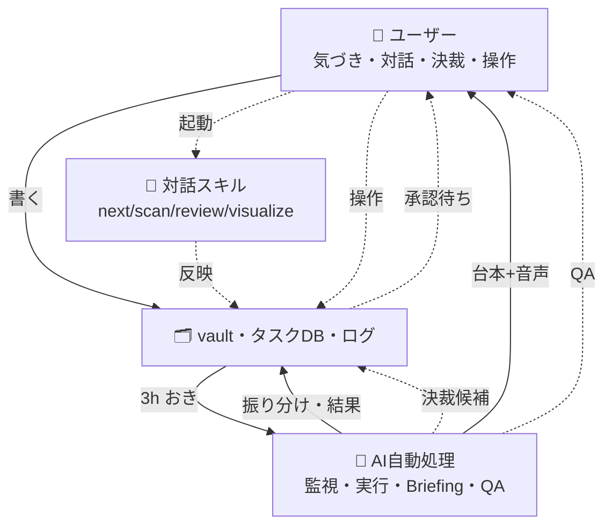

# 🔄 SHUKI運用フロー図

> [!note] 🔄
>
> ユーザーの行動・意思決定と、AIエージェント群の働きを1枚のフローにした参照資料。`可視化スキル`（[[../.claude/skills/visualize/SKILL.md|visualize skill]]）の実例第1号として作成（2026-08-04）。
> **実線＝スケジューラ/エージェントが無人で実行する自動化済みの経路。点線＝ユーザーの判断・操作が必要な経路。** `⚙️ 定期便カタログ.md` の表とエージェント一覧を元に機械的に区別した。

> [!note]- 2026-08-08 mermaid比ルール違反により再構成
> 旧版（4サブグラフ×個別ノード）は実寸2657px＝倍率0.26で文字が読めない状態だった。4サブグラフの密結合クロスリンクは向き変更・スペーシング調整では倍率0.9に届かず、俯瞰図＋内訳リストの2段構成に変更（情報は削っていない）。

**各層の内訳**（実線＝無人自動実行、点線＝ユーザーの判断・操作が必要）：

- **👤 ユーザー**：気づき・出来事・思いつき／チャットで対話／決裁パネルで承認・却下／ブリーフィングを聴く・読む／ダッシュボードで操作
- **🤖 AI自動処理（スケジューラ駆動・無人）**：ObsidianInboxMonitor（3時間おき: 振り分け+決裁補充）／Claude-TaskDispatch（12:30: タスク実行）／Claude-Briefing（7:00: 収集→執筆→音声化）／Claude-VaultLint・NightQA（整合性チェック）／decisions.py（決裁確定→due同期）
- **💬 対話スキル（ユーザーが呼ぶ・要確認）**：/next /schedule（今やる一手・時間割）／/scan /ops-review（精緻化・運用見直し）／/weekly-review /finance-review（週次・月次振り返り）／visualize（可視化提案）
- **🗂 vault / ダッシュボード**：01_Inbox／04_Tasks タスクDB／06/07 ナレッジ・ログ／99_System ui-queue/decisions／SHUKIダッシュボード

## 見えること

- **実線（無人自動）が多いのは「収集・執筆・実行」側**：インボックス振り分け、タスクディスパッチ、ブリーフィング生成、QA監視はユーザーが手を動かさずに回っている
- **点線（ユーザーの判断待ち）は「決裁・確認・起動」に集中**：決裁承認、対話スキルの起動、ダッシュボード操作、週次/月次の深掘りは、仕組みが用意した材料をユーザーが選ぶ・確認する役目
- ループの起点も終点もユーザー（`気づき・出来事` → … → `ブリーフィングを聴く` → 次の気づき）＝AIは代行者ではなく、気づきを増幅して返すループの一部として設計されている

## 今後の方針決定に使う視点

図をただ眺めて終わらせないための問いだけを置く。答えはここには書かない。

- 点線（ユーザーの判断待ち）の中で、実は判断基準が固定的で自動化できそうな経路はどれか？
- 実線（自動化済み）の中で、量が多すぎて逆に見落としが増えている経路はないか？
- 「気づき→ブリーフィング→次の気づき」のループは、実際に自分の行動を変える頻度でどれくらい回っているか？
- 対話スキル（S1-S4）は呼ばれる頻度に偏りがあるか？呼ばれていないスキルは要らないのか、存在を忘れているだけか？

## 詳細版：グラフィックレコーディング風の全図（2026-09-27）

上の俯瞰図（4ノード）の内訳を、24時間の定期便・vault・AI作業・出口・ガードまで1枚に描いたもの。出典は `⚙️ 定期便カタログ.md`・`🏢 AI組織図 ＆ RACI.md`・`AGENTS.md`。

![[2026-09-27_SHUKI_workflow_graphicrecording.svg]]

- 問い：この図で「点線ピンク（ユーザーの番）」に載っているカードのうち、実は毎回同じ答えを返しているものはどれか？
