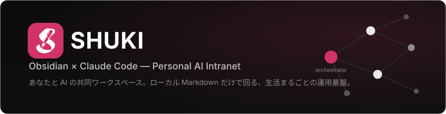
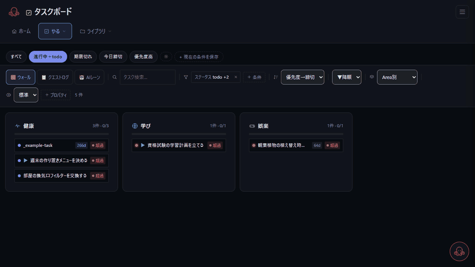
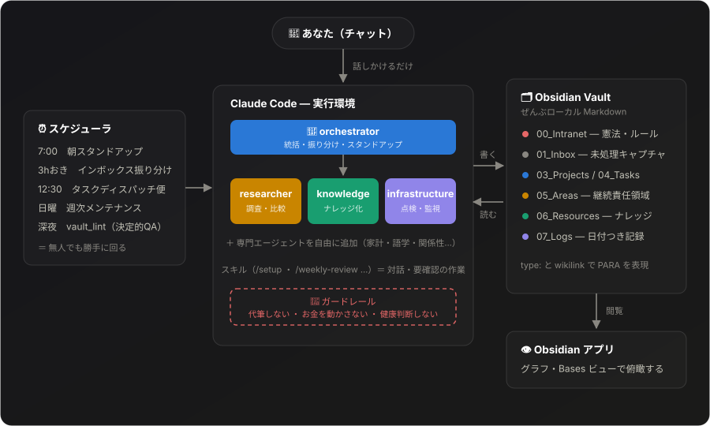

<div align="center">



[](LICENSE)
[](https://obsidian.md/)
[](https://claude.com/claude-code)
[](README.en.md)

</div>

**話しかけるだけで、メモが然るべき場所に片付く。**



## ⚡ 3行でいうと

- 🗂 **生活まるごとローカル Markdown** — 仕事・お金・英語・人間関係・内省を1つの Obsidian vault に。ベンダーロックインなし、git で差分管理。
- 🤖 **チャットが入口、ファイルは出力** — [Claude Code](https://claude.com/claude-code) に話しかけるだけ。名前と役割を持つエージェント群が振り分け・調査・ナレッジ化し、定期ルーティンが無人で回る。
- 🚫 **「AIにやらせないこと」が決めてある** — 代筆・送金・健康判断は人間の領分。ガードレールがツール権限で技術的に強制される。

> 🧩 **このリポジトリはコア機能だけを公開しています** — AIチャット・タスク・カレンダー・News・決裁カード。作者の環境で動いている概念図鑑・称号・習慣・家計・英語練習・可視化などのプラグインは含めていません。



<sub>▲ ダッシュボードの実画面（約15秒）。このリポジトリを clone して、同梱のサンプルデータだけで撮影しています。</sub>

## 🗺 全体像



<details>
<summary>📁 テキスト版のフォルダ構成を見る</summary>

```
Obsidian Vault（ローカルMarkdown）
├── 00_Intranet/     ← 「憲法」：全エージェントが必ず読むルール集
├── 03_Projects/     ← 期限つきタスクの束（type: project）
├── 04_Tasks/        ← 1ファイル1タスク（status / 期限 / 担当 / area）
├── 05_Areas/        ← 継続責任領域（各1ハブノート）
├── 06_Resources/    ← 再利用ナレッジ＋概念ノード（グラフのハブ）
├── 01_Inbox/        ← 未処理キャプチャ、orchestrator が自動振り分け
├── 07_Logs/         ← 日付つき記録（レビュー・内省）
└── .claude/
    ├── agents/      ← エージェント定義（コア4体＋専門エージェントは自分で追加）
    └── skills/      ← 対話・要確認のワークフロー
```

</details>

> **このリポジトリは「仕組みだけ」**を配布します — エージェント・ルール（`00_Intranet/`）・運用マニュアル（`CLAUDE.md`）・テンプレート（`_Templates/`）。各 PARA フォルダには、用途を説明する短い `README.md` と、**プロパティの使い方を示す骨組み例 `_example-*.md` を1つずつ**同梱しています。**個人のノート・ログ・リソースは一切含みません** — 例ファイルは理解したら削除してください。

## 🎚 どこまで使うか（3段階・上から順に足していく）

全部入りである必要はありません。**A だけでも完成した使い方**です。B・C は欲しくなったら足す方式で、途中で止めても何も壊れません。

| 段 | 中身 | 必要なもの | 向いている人 |
|---|---|---|---|
| **A. AI付きの個人wiki** | vault骨格 ＋ `CLAUDE.md` ＋ `.claude/`（エージェント・スキル） | Obsidian ＋ Claude Code | チャットでノートを育てたい人。**まずここから** |
| **B. ＋ ダッシュボード** | `scripts/dashboard_*.py` を使う時だけ起動 | ＋ Python 3（標準ライブラリのみ・追加インストール不要） | タスクをカンバンで見たい・ブラウザのUIが欲しい人 |
| **C. ＋ 定期ルーティン** | Task Scheduler / cron で News 取得やインボックス振り分けを無人実行 | ＋ 常時起動する（またはよく開く）PC | 自分が動かなくても回ってほしい人 |

**A の人は `scripts/` フォルダを丸ごと無視して構いません。** clone しても、起動しなければ何も動きません（常駐プロセスもインストールも無し）。B・C の設定は A を導入したあとに `/setup` から追加できます。

> 🔬 **研究者の方へ**: 論文の新着追跡とタスク管理だけに絞った専用の導入手順があります → **[QUICKSTART-RESEARCH.md](docs/QUICKSTART-RESEARCH.md)**（定期実行を入れずに A→B だけ立ち上げる道順）

## 🚀 クイックスタート

> 詳細は [docs/SETUP.md](docs/SETUP.md)。ここではエッセンスだけ。

**手作業はこれだけ（〜15分）：**

1. [Git](https://git-scm.com/downloads) をインストール（リポ取得用。ZIPダウンロードでも代用可）
2. [Claude Code](https://docs.claude.com/en/docs/claude-code/overview) をインストール（操作の主役。Anthropic アカウント・有料が必要）
3. [Obsidian](https://obsidian.md/) をインストール（ノート閲覧・グラフ表示用のビューア）
4. このリポをクローン（`git clone https://github.com/sflren6741/SHUKI my-vault`）→ Obsidian で「Open folder as vault」で開く
5. vault フォルダで `claude` を起動（`cd my-vault && claude`）

> 各ステップの詳しい入れ方・つまずき対処は [docs/SETUP.md](docs/SETUP.md) に1ページでまとめてあります。

**あとはチャットで完結：**

```
/setup
```

Identity・価値観・Areas・パス設定・Obsidianプラグイン案内・自動化スクリプト生成まで、Claude Code が対話しながらすべて設定します。ファイルを直接編集する必要はありません。

セットアップが済んだら、思いついたことをそのまま話しかけてみてください（「メモ追加：〇〇」「今週の進行中タスクを見せて」）。迷ったら **`/next`** で「今やる一手」が1つ出ます。

<a id="english-ui"></a>

### 🇬🇧 English UI

ダッシュボードの表示言語は設定1行で切り替わります。`scripts/shuki_paths.json` に:

```json
{ "lang": "en" }
```

未指定なら `ja`（翻訳辞書を読まず素通し）。辞書は `scripts/i18n/<lang>.json` で、**キーは日本語の原文そのまま**です。訳が無いキーは原文のまま表示されるだけなので、部分的に訳した状態でも壊れません。辞書に足せばそのまま反映されます（未訳の洗い出しは `python scripts/i18n_scan.py`）。

英語のドキュメント一式は **[README.en.md](README.en.md)** と **[docs/en/](docs/en/)** にあります（同じリポジトリ内。英語版を別リポジトリに分ける運用は 2026-08-11 に廃止しました）。

> **English**: full English docs live in [README.en.md](README.en.md) and [docs/en/](docs/en/) — same repository, no separate fork. The dashboard UI language is a one-line setting: put `"lang": "en"` in `scripts/shuki_paths.json`. Translations live in `scripts/i18n/<lang>.json`, keyed by the original Japanese string, so anything missing falls back to the original text instead of breaking the page. Your **own vault content stays in whatever language you write it in**; only the interface is translated.

なお vault 側のルールファイル（`00_Intranet/`）は日本語で書かれています。構造とロジックはそのまま通用するので、自由にローカライズしてください。

---

## なぜ作ったか

仕事・お金・英語・スポーツ・人間関係・内省――生活まるごとを一箇所に整理し、その上で「ただのチャット窓」ではなく **実際に運用を手伝ってくれるAIレイヤー** が欲しかった。

普通のチャット型AIはセッションをまたぐと全部忘れるし、「この情報をどこに置くべきか」という意見を持たない。そこで素の Obsidian vault を小さな組織にしました：**役割と境界が明確な名前付きエージェント群**、**type駆動のファイリング**、そして勝手に回る **定期ルーティン**。Claude Code が実行環境、Obsidian がDB兼UIです。

このリポジトリは **仕組み（フレームワーク）だけ** ――エージェント・ルール・テンプレート・構造のみ。個人ノートは一切含みません。

## ここが良い（自分の観点）

- **ローカルファースト＆プライベート** — 全部が自分のマシン上の Markdown。ベンダーロックインなし、全文検索可、gitで差分管理、素のObsidianで編集可。
- **「何でも屋1体」より「専門家複数体」** — 1つのアシスタントに全部やらせるのではなく、トリアージ・調査・計画・ナレッジ…と各エージェントがドメインを持ち、チャットの埋もれではなく **タスク経由でハンドオフ** する。
- **type駆動のPARA** — Projects/Areas/Resources/Archive を硬いフォルダではなく `type:` プロパティと wikilink で表現。Obsidian Bases ＋ プロパティのおかげで、フォルダ駆動より属性駆動の方が圧倒的に柔軟。
- **信頼は制約から生まれる** — 一番効いている設計は「AIに**禁止**していること」。センシティブな相手への文章は代筆しない、お金は動かさない、健康判断はしない――全部人間の領分。複数のエージェントはツール権限で読み取り専用にしてあり、境界が**技術的に強制**されている。
- **積み上がる自動化** — News の取得・インボックス振り分け・タスクディスパッチ便がスケジュールで回る（週次レビューは人間が起動する対話スキル）。明文ルールのQAは決定的な linter（`scripts/vault_lint.py`・LLM不使用）が拾う（ルール判定を LLM に任せると誤検出するため）。
- **自分で育つナレッジグラフ** — 繰り返し出るテーマは「概念ノード」になりノート横断でリンクされる。使うほどvaultの結合度が上がる。

## コア4体のエージェント（＋自分でカスタム追加）

| Tier | エージェント | 役割 |
|---|---|---|
| 統括 | `orchestrator` | 振り分け・週次レビュー・タスクディスパッチ便 |
| コア | `researcher` | 旅行・購入・比較などの具体的リサーチ（実予約・実購入はしない） |
| コア | `knowledge` | URL/コンテンツをリンク付きナレッジ化・週次グラフ整備 |
| コア | `infrastructure` | タスクDB点検・重複/静かな故障の検出（提案のみ・Read専用） |
| ＋ | `<専門エージェント>` | 家計・語学・関係性・内省など自分の生活に合わせて追加（[AGENTS.md](docs/AGENTS.md) 参照） |

**エージェント＝無人・定型／スキル＝対話・要確認。** センシティブな作業（週次レビュー・タスク棚卸）は人間が必ずループに入れるよう、前面の **スキル** として動かします。専任 reviewer は置かず、QAは「セルフQA＋オーナー確認＋決定的 lint」に分散しています。

## 📊 ダッシュボード（B段・オプション）

チャットとは別に、ブラウザで見るローカルダッシュボードも同梱しています（`scripts/dashboard_server.py`、標準ライブラリのみ・追加インストール不要）。**使う時だけ起動する**方式で、常駐させる必要はありません。要らなければ起動しなければよく、A段のままで完結します。

```
python scripts/dashboard_server.py
```

`http://127.0.0.1:8765/` を開くと使えます。パスは `scripts/shuki_paths.example.json` を `shuki_paths.json` にコピーして自分の vault パスを設定してください（`.gitignore` 対象）。

使えるページ：

| ページ | 内容 |
|---|---|
| 🏠 ホーム（`/`） | 今日のフォーカス・スキルランチャー |
| 📋 タスク（`/board`） | タスクDBのカンバン（期限切れ・今日・今週・進行中） |
| 📅 カレンダー（`/calendar`） | 予定とタスクを日付で見る（Google カレンダー連携は任意） |
| 📰 ニュース（`/news`） | 購読フィードの新着から Claude が選んだ記事（`python scripts/news_fetch.py` で取得） |
| ⚖️ 決裁（`/decisions`） | AI が人間の判断を求めているカード |

> **このリポジトリに含めていない機能**：作者の環境では、概念図鑑・称号・習慣・家計・英語練習・可視化などがプラグインとして動いています。今回の公開はコア機能だけで、それらのコードは含みません。プラグインを読み込む仕組み（`scripts/shuki_core/plugins.py`）は同梱しています。

## 📚 詳細な再現ガイド

目標は **「このリポを見れば運用をそのまま再現できる」**（その上でカスタマイズ可）。詳細は [`docs/`](docs/) に：

| ガイド | 内容 |
|---|---|
| [SETUP.md](docs/SETUP.md) | 全体手順：vault作成→このリポ導入→Identity記入→Claude Code起動 |
| [QUICKSTART-RESEARCH.md](docs/QUICKSTART-RESEARCH.md) | 🔬 研究者向け：論文の新着追跡＋タスク管理だけに絞った最短導入（定期実行なし） |
| [OBSIDIAN-SETUP.md](docs/OBSIDIAN-SETUP.md) | プラグイン・設定（Templater / Linter / Bases / リンク） |
| [AGENTS.md](docs/AGENTS.md) | エージェントの仕組みと **自作の仕方** |
| [MOBILE-SYNC.md](docs/MOBILE-SYNC.md) | Android + Obsidian + **FolderSync** での同期手順 |
| [AUTOMATION.md](docs/AUTOMATION.md) | News取得/振り分け/ディスパッチ/決定的QA の定期実行 |
| [TIPS.md](docs/TIPS.md) | 思考モデル：type駆動PARA・**wikilink**・概念ノード・境界 |

## 日常の使い方

メインのインターフェースは **Obsidian ではなく Claude Code**。Obsidian は閲覧・グラフ確認用、Claude Code は作成・整理用。

```
# インボックスに何でも投げる — Claude が振り分ける
「メモ追加：『Think Fast and Slow』を読みたい」
「インボックス：プロジェクト提案のフォローアップを忘れずに」

# 整理・検索
「今週の進行中タスクを見せて」
「先週のランニングに関するログをまとめて」

# ナレッジ化
「このURLをナレッジノートにして: https://...」
「<テーマ>について自分が知っていることは？」

# 週次レビュー（対話型 — 人間が必ずループに入る）
/weekly-review
```

全部チャットで完結する。vault ファイルは入力ではなく出力。Obsidian を開くのは、グラフを見たい・ノートを読みたい・Bases のビューで俯瞰したいときだけ。

## 注意

- これは **個人システム** で、自分の思考に合わせて尖らせてあります。製品ではなく出発点として扱ってください。
- お金／健康／外部発信は意図的に人間確認の後ろに置いています。このガードレールは残すことを推奨します。

## 問い合わせ

質問・アイデア・構成の比較など、**[GitHub Issue](../../issues) を立ててください。** 連絡先として一番確実です。

## ライセンス

[MIT](LICENSE)。
